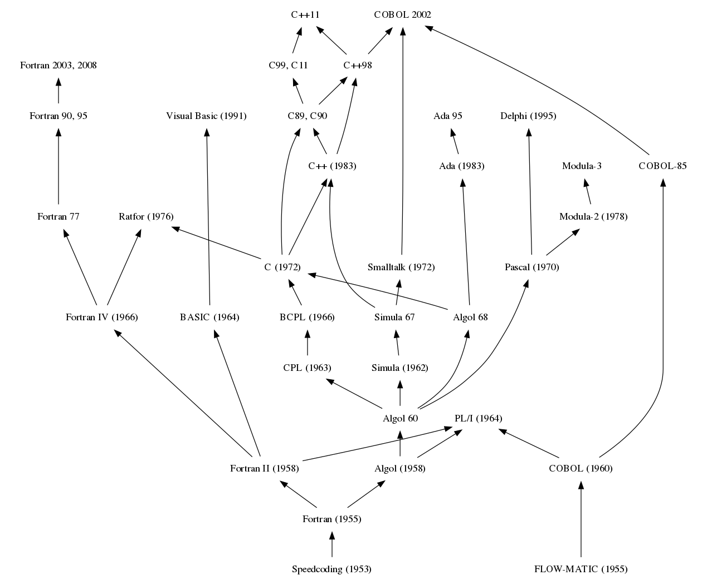

# Library

This is the library of books that I have read or am reading. The books are
split into strictly academic books, and other. Files are filetype: pdf
in majority.

- [Library](#library)
  - [Textbooks](#textbooks)
  - [Books](#books)
  - [Sources](#sources)
  - [Technical History](#technical-history)
    - [Alogol (Fortran & Cobol) Family Tree](#alogol-fortran--cobol-family-tree)
  - [Quotes](#quotes)
    - [Feynman](#feynman)

## Textbooks

The books within this subdirectory are all either proper collegiate textbooks,
mostly in the areas of mathematics, physics, and computer science. Most of these
are, in my opinion, are the absolute best for their subject. A few resources
in this section are also lecture notes.

- Lecture Notes
 <!-- fix link here, should point to pdf -->
- [Calculus of Several Variables (MIT 18.022 Fall 2010)]("./../README.md") - Instructed: Prof. James McKernan
  - Lecture Notes {1-24}
  - [MIT Course](https://ocw.mit.edu/courses/mathematics/18-022-calculus-of-several-variables-fall-2010/index.htm)
- [An Introduction to Mechanics](Textbooks/An Introduction to Mechanics) - Authored: Daniel Kleppner, Robert J.
    Kolenkow
- [Linear Algebra Done Right](Textbooks/Liear Algebra Done Right, Second Edition), Second Edition - Authored: Sheldon Axler
- [Principles of Mathematical Analysis, Third Edition](Textbooks/Principles of Mathematical Analysis, Third Edition.pdf) - Authored: Walter Rudin
- [Vector Calculus, Fourth Edition](Textbooks/Vector Calculus, Fourth Edition.pdf) -
    Authored: Susan Jane Colley

## Books

Books are read in motivation of expanding knowledge.

- [The Gulag Archipelago, Volume 1](Books/The Gulag Archipelago, Volume 1)

## Sources

- [Library Genesis](gen.lib.rus.ec)
  - Note that this is a questionable resource that is used to source
    textbooks when I do not have the monetary resources to purchase them. As
    you can imagine these resources are never available due to the cost of
    textbooks. If you would like to read this resource be aware of the sites
    function which is partially described in this
    [letter of solidarity](https://custodians.online/). Be aware too that
    this link may be broken as the database of the LibGen is accessed through a
    non-centralized network of sites that are not _yet_ taken down.
- [MIT OpenCourseWare](ocw.mit.edu)
  - This is a very good source for collegiate resources. Many are not
    aware that the good academics at MIT believe that education should be open
    and share many courses in entirety. Some textbooks have come from the
    website directly due to the textbooks being written by professors who
    have made it free to students. Most textbooks have at least been included
    due to the study from them directed from MIT OpenCourseWare courses. Some
    of the MIT OpenCourseWare courses have moved me to include lecture notes
    that come with the course if it had significant effect on learning the
    courses' content.

## Technical History

Information regarding the technical history of some products, standards, etc.

### Alogol (Fortran & Cobol) Family Tree

## Quotes

Some academic-related -hopefully inspirational- quotes.

### Feynman

